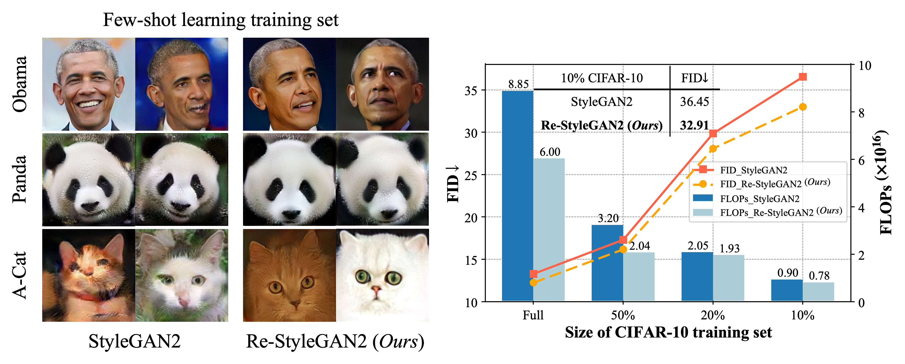
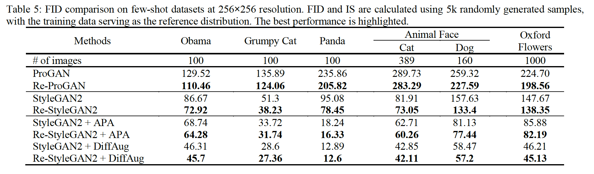

## Re-GAN: Data-Efficient GANs Training via Architectural Reconfiguration, CVPR 2023


### Abstract

---
Training Generative Adversarial Networks (GANs) on high-fidelity images usually requires a vast number of training images. Recent research on GAN tickets reveals that dense GANs models contain sparse sub-networks or "lottery tickets" that, when trained separately, yield better results under limited data. However, finding GANs tickets requires an expensive process of train-prune-retrain. In this paper, we propose Re-GAN, a data-efficient GANs training that dynamically reconfigures GANs architecture during training to explore different sub-network structures in training time. Our method repeatedly prunes unimportant connections to regularize GANs network and regrows them to reduce the risk of prematurely pruning important connections. Re-GAN stabilizes the GANs models with less data and offers an alternative to the existing GANs tickets and progressive growing methods. We demonstrate that Re-GAN is a generic training methodology which achieves stability on datasets of varying sizes, domains, and resolutions (CIFAR-10, Tiny-ImageNet, and multiple few-shot generation datasets) as well as different GANs architectures (SNGAN, ProGAN, StyleGAN2 and AutoGAN). Re-GAN also improves performance when combined with the recent augmentation approaches. Moreover, Re-GAN requires fewer floating-point operations (FLOPs) and less training time by removing the unimportant connections during GANs training while maintaining comparable or even generating higher-quality samples. When compared to state-of-the-art StyleGAN2, our method outperforms without requiring any additional fine-tuning step.

### Impressive results

---



### Prerequisites
---

Our codes were implemented by Pytorch, we list the libraries and their version used in our experiments, but other versions should also be worked.
1. Linux         (Ubuntu)
2. Python        (3.8.0)
3. Pytorch         (1.13.0+cu116)
4. torchvision         (0.14.0)
5. numpy (1.23.4)

## Getting Started


### Usage

---
Should you have any questions about this repo, feel free to contact Jiahao Xu @ jiahxu@polyu.edu.hk

#### Hyperparameters introduction for SNGAN

| Argument        | Type       | Description                                                               |
|-----------------|------------|---------------------------------------------------------------------------|
| `epoch`         | int        | Number of total training epochs                                           |
| `batch_size`    | int        | Batch size of per iteration, choose a proper value by yourselves          |
| `regan`         | store_true | Enable ReGAN training or not                                              |
| `sparsity`      | float      | Target sparsity k, e.g. sparsity=0.3 means 30% of weights will be pruned  |
| `g`             | int        | The update interval                                                       |
| `warmup_epoch`  | int        | Warmup training epochs                                                    |
| `data_ratio`    | float      | To simulate a training data limited scenario                              |


#### Hyperparameters introduction for ProGAN

| Argument        | Type       | Description                                                               |
|-----------------|------------|---------------------------------------------------------------------------|
| `regan`         | store_true | Enable ReGAN training or not                                              |
| `sparsity`      | float      | Target sparsity k, e.g. sparsity=0.3 means 30% of weights will be pruned  |
| `g`             | int        | The update interval                                                       |
| `warmup_epoch`  | int        | Warmup training epochs                                                    |
| `data_ratio`    | float      | To simulate a training data limited scenario                              |

For batch size of training epochs at each stage of ProGAN, you may define them on the main.py.

#### Hyperparameters introduction for StyleGAN2

| Argument      | Type       | Description                                                                            |
|---------------|------------|----------------------------------------------------------------------------------------|
| `iter`        | int        | Number of total training iterations                                                    |
| `batch_size`  | int        | Batch size of per iteration, choose a proper value by yourselves                       |
| `regan`       | store_true | Enable ReGAN training or not                                                           |
| `sparsity`    | float      | Target sparsity k, e.g. sparsity=0.3 means 30% of weights will be pruned               |
| `g`           | int        | The update interval                                                                    |
| `warmup_iter` | int        | Warmup training iterations                                                             |
| `diffaug`     | store_true | Enable DiffAug or not                                                                  |
| `eva_iter`    | int        | Evaluation frequency                                                                   |
| `eva_size`    | int        | Evaluation size, for few-shot dataset, we use eva_size=5000                            |
| `dataset`     | str        | which dataset to use, please make sure you place the dataset dictionary in right place |
| `size`        | int        | Size of training image, for few-shot dataset, size=256                                 |
| `ckpt`        | str        | If you want to resume your training, you can use this argument                         |


#### Data Preparation
Pytorch will download the CIFAR-10 dataset automatically if the dataset is not detected, therefore there is no need to prepare CIFAR-10 dataset.

For Tiny-ImageNet dataset, you may get it from https://www.kaggle.com/datasets/akash2sharma/tiny-imagenet.

For FFHQ dataset, you may get it from https://github.com/NVlabs/stylegan.

For Few-shot dataset, you may get it from https://github.com/odegeasslbc/FastGAN-pytorch.
Besides, we provide the lmdb data of Few-shot dataset for your convenience, you may get it from [here](https://drive.google.com/file/d/1bDRlddUxytLSElnrlr9IDydsMVDxm5Bm/view?usp=sharing "fewshow_lmdb").


#### Example

To run a Re-SNGAN or Re-ProGAN model, you may follow:
1. Clone this repo to your local environment.
```
git clone https://github.com/IntellicentAI-Lab/Re-GAN.git
```
2. Prepare all the required libraries and datasets.


3. Run your model! One example can be:
```
# For SNGAN
python main.py --epoch 1000 --data_ratio 0.1 \
--regan --warmup_epoch 200 --g 100 --sparse 0.3 

# For ProGAN
python main.py --data_ratio 0.1 \
--regan --warmup_epoch 10 --g 10 --sparse 0.3 
# Please define epoch and batch size in the main.py
```

---

To run a Re-StyleGAN2 model on few-shot dataset, you may follow:
1. Clone this repo to your local environment.
```
git clone https://github.com/IntellicentAI-Lab/Re-GAN.git
```
2. Prepare all the required libraries and datasets. For dataset, please place them like following panda example:
   1. ReGAN/dataset/panda
   2. ReGAN/dataset/pandalmdb


3. Run your model! One example can be:
```
python train.py --size 256 --batch 32 --iter 40000 --dataset panda --eva_iter 2000 --eva_size 100 \
--regan --warmup_iter 10000 --g 5000 --sparsity 0.3 \
--diffaug # Indicate it if you want to use DiffAugmentation
```

### Evaluation metrics

___
We conclude how we calculate some used metrics shown in our paper in this section.

| Metrics          | Description                                                                                                                                                        | 
|------------------|--------------------------------------------------------------------------------------------------------------------------------------------------------------------|
| `#Real images`   | The number of real images that are shown to the discriminator. You can calculate it by training epochs and batch size.                                             | 
| `FLOPs`          | Floating Point Operations. You can calculate it by using [thop](https://github.com/Lyken17/pytorch-OpCounter) library.                                             |
| `Training time`  | The total training time. Note that the training time reported in our paper is not included the evaluation time.                                                    |
| `MSE difference` | The MSE difference. We periodically (per epoch) save an image that contains 64 samples which are generated with fixed noise, then calculated the pixel difference. |

We provide some codes on quantitative evaluation, you can check the StyleGAN folder and see lines 347 to 379 on the train.py to learn how to evaluate FID. Calculating IS is a very similar process.

### Citation

___
If you use this code for your research, please cite our papers.

```
@InProceedings{Saxena_2023_CVPR,
    author    = {Saxena, Divya and Cao, Jiannong and Xu, Jiahao and Kulshrestha, Tarun},
    title     = {Re-GAN: Data-Efficient GANs Training via Architectural Reconfiguration},
    booktitle = {Proceedings of the IEEE/CVF Conference on Computer Vision and Pattern Recognition (CVPR)},
    month     = {June},
    year      = {2023},
    pages     = {16230-16240}
}
```

### Acknowledgment

___
We would like to thank the work that helps our paper:

1. FID score: https://github.com/bioinf-jku/TTUR.
2. Inception score: https://github.com/w86763777/pytorch-gan-metrics.
3. DiffAugmentation: https://github.com/VITA-Group/Ultra-Data-Efficient-GAN-Training.
4. AutoGAN: https://github.com/VITA-Group/AutoGAN.
5. APA: https://github.com/endlesssora/deceived.
6. SNGAN: https://github.com/w86763777/pytorch-gan-collections.
7. ProGAN: https://github.com/BakingBrains/Progressive_GAN-ProGAN-_implementation.
8. StyleGAN2: https://github.com/rosinality/stylegan2-pytorch.


